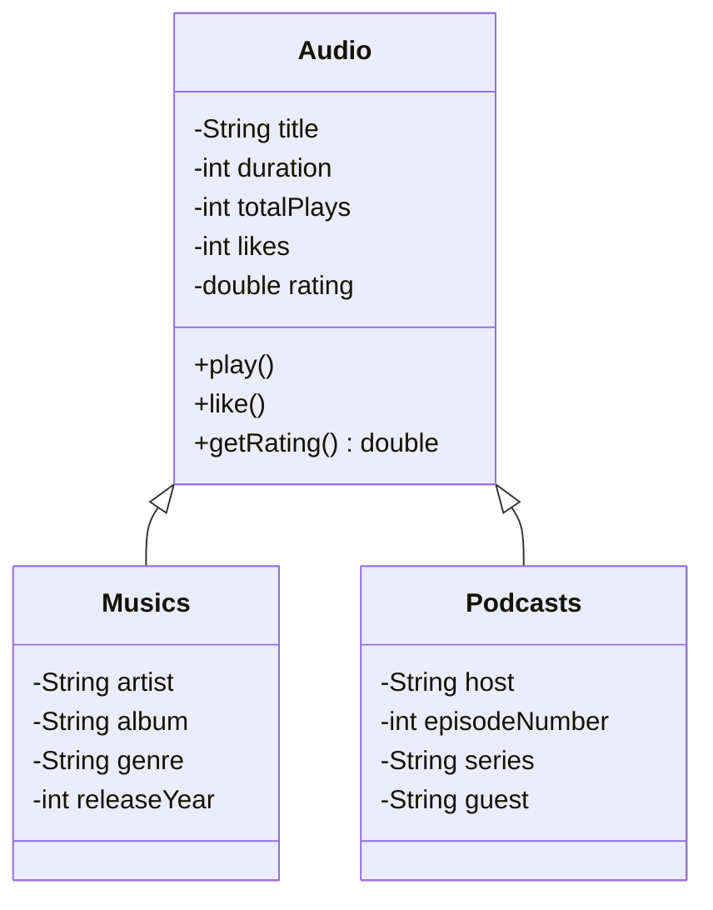

# 🎵 MusicApp - Audio Streaming Simulator
<div align="center">


A modern Java application demonstrating Object-Oriented Programming principles through an audio streaming simulation.
[Features](#features) • [Architecture](#architecture) • [Installation](#installation) • [Usage](#usage) • [Contributing](#contributing)
</div>
## 🚀 Overview
MusicApp is a comprehensive Java application that simulates an audio streaming service, designed specifically to practice and demonstrate core Object-Oriented Programming concepts. The application manages various audio content types with a clean, extensible architecture.
## ✨ Features
| Feature | Description | Status |
|---------|-------------|---------|
| 🎶 **Audio Management** | Base class with common audio properties and behaviors | ✅ Implemented |
| 🎵 **Multiple Content Types** | Support for music and podcasts with specialized properties | ✅ Implemented |
| ⭐ **Smart Rating System** | Automatic content rating based on user interactions | ✅ Implemented |
| 📊 **Playback Statistics** | Track plays, likes, and listening time | ✅ Implemented |
| 🎛️ **Playback Control** | Play, pause, and like functionality | ✅ Implemented |
| 📱 **Encapsulated Design** | Secure data access through proper encapsulation | ✅ Implemented |
## 🏗️ Architecture
### Core Class Structure

### Project Structure
```
br.com.alura.musicapp/
├── 📁 models/
│ ├── Audio.java # 🎯 Superclass with core functionality
│ ├── Musics.java # 🎵 Music-specific implementation
│ ├── Podcasts.java # 🎙️ Podcast-specific implementation
│ └── Playlists.java # 📋 Playlist management
├── 📁 calculus/
│ └── TimeCalculation.java # ⏰ Playback time utilities
└── Main.java # 🚀 Application entry point
```
## 🛠️ Installation
### Prerequisites
- **Java JDK 17** or higher
- **Git** for version control
### Quick Start
1. **Clone the repository**
   ```bash
   git clone https://github.com/your-username/musicapp.git
   cd musicapp
   ```
2. **Compile the project**
   ```bash
   javac -d out br/com/alura/musicapp/**/*.java br/com/alura/musicapp/Main.java
   ```
3. **Run the application**
   ```bash
   java -cp out br.com.alura.musicapp.Main
   ```
### Using Build Tools
#### Maven
Add to your `pom.xml`:
```xml
<dependencies>
    <dependency>
        <groupId>br.com.alura</groupId>
        <artifactId>musicapp</artifactId>
        <version>1.0.0</version>
    </dependency>
</dependencies>
```
#### Gradle
```gradle
dependencies {
    implementation 'br.com.alura:musicapp:1.0.0'
}
```
## 💻 Usage
### Basic Audio Operations
```java
// Create music instance
Musics song = new Musics();
song.setTitle("Bohemian Rhapsody");
song.setArtist("Queen");
song.setDuration(355);
// Play and interact
song.play(); // Increments play count
song.like(); // Adds a like
// Get calculated rating
double rating = song.getRating();
System.out.println("Song rating: " + rating);
```
### Creating Podcasts
```java
Podcasts episode = new Podcasts();
episode.setTitle("Java Weekly");
episode.setHost("Tech Talks");
episode.setEpisodeNumber(42);
episode.setDuration(1800); // 30 minutes
```
## 🎯 OOP Principles Demonstrated
| Principle | Implementation | Benefit |
|-----------|----------------|---------|
| **Inheritance** | `Musics` and `Podcasts` extend `Audio` | Code reuse and hierarchy |
| **Polymorphism** | Unified interface for different audio types | Flexible and extensible |
| **Encapsulation** | Private attributes with public methods | Data security and control |
| **Abstraction** | Simplified interfaces for complex operations | Easy to use and maintain |
## 📚 Learning Outcomes
This project serves as an excellent resource for understanding:
- ✅ **Class Design**: Proper class hierarchy and relationships
- ✅ **Access Modifiers**: Effective use of private, protected, and public
- ✅ **Method Overriding**: Custom implementation in subclasses
- ✅ **Object Composition**: Building complex objects from simpler ones
- ✅ **Java Best Practices**: Clean code and proper documentation
## 🤝 Contributing
We love contributions! Here's how you can help:
1. **Fork** the repository
2. **Create** a feature branch (`git checkout -b feature/amazing-feature`)
3. **Commit** your changes (`git commit -m 'Add amazing feature'`)
4. **Push** to the branch (`git push origin feature/amazing-feature`)
5. **Open** a Pull Request
### Development Setup
```bash
# Set up development environment
git clone https://github.com/your-username/musicapp.git
cd musicapp
# Create your feature branch
git checkout -b feature/your-feature-name
# Make your changes and test
javac -d out src/**/*.java
java -cp out br.com.alura.musicapp.Main
```
## 📄 License
This project is licensed under the MIT License - see the [LICENSE](LICENSE) file for details.
## 🙏 Acknowledgments
- Inspired by Alura's Java curriculum
- Built to demonstrate practical OOP applications
- Community contributions and feedback
---