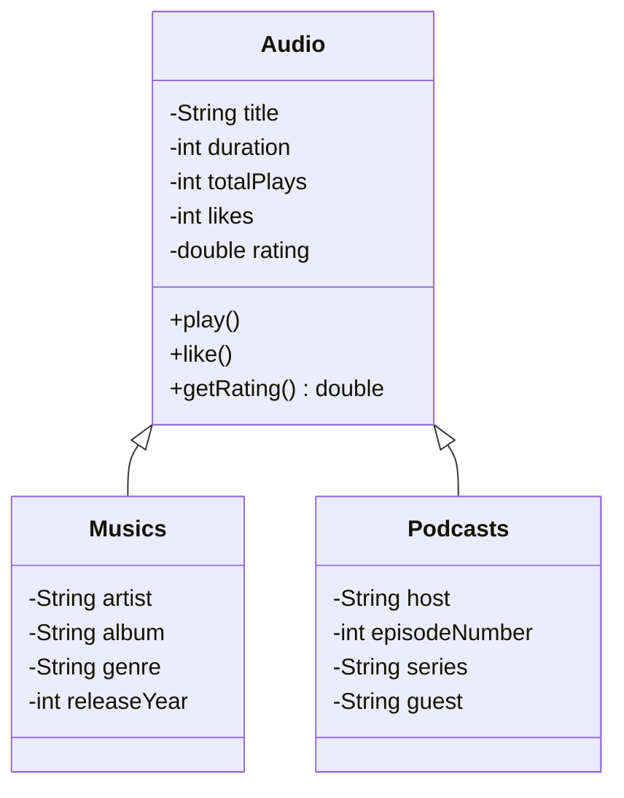

# 🎵 MusicApp — Java Audio Streaming Simulator

<div align="center">


A modern Java application that simulates an audio streaming platform and showcases Object-Oriented Programming concepts.

[Features](#-features) • [Architecture](#-architecture) • [Installation](#-installation) • [Usage](#-usage) • [Contributing](#-contributing)

</div>

---

## 🚀 Overview

**MusicApp** is a fully object-oriented Java project designed to demonstrate clean architecture, inheritance, polymorphism, and encapsulation through an audio streaming simulation.  
It supports multiple audio types (music and podcasts), handles playback statistics, ratings, and playlists, and provides an easy foundation to extend the system.

---

## ✨ Features

| Feature | Description | Status |
|---------|-------------|--------|
| 🎶 **Audio Base Class** | Shared properties and methods for all audio types | ✅ |
| 🎵 **Music Support** | Artist, album, genre, release year | ✅ |
| 🎙️ **Podcast Support** | Host, series, guest, episode number | ✅ |
| ⭐ **Smart Rating System** | Dynamic rating based on interactions | ✅ |
| 📊 **Playback Analytics** | Plays, likes, total listening time | ✅ |
| 🎛️ **Player Controls** | Play, pause, like | ✅ |
| 🔒 **Encapsulation** | Private fields + controlled getters/setters | ✅ |
| 📋 **Playlists** | Group and manage audio items | ✅ |

---

## 🏗️ Architecture

### Class Diagram


---
## 🛠️ Installation

### **Prerequisites**
- **Java 17+**
- **Git**

### **Clone & Run**

```bash
git clone https://github.com/your-username/musicapp.git
cd musicapp
javac -d out br/com/alura/musicapp/**/*.java br/com/alura/musicapp/Main.java
java -cp out br.com.alura.musicapp.Main
```
---
## 🎯 OOP Principles Demonstrated

| Principle         | Implementation                       | Why It Matters                 |
| ----------------- | ------------------------------------ | ------------------------------ |
| **Inheritance**   | `Musics` & `Podcasts` extend `Audio` | Reduces duplication            |
| **Polymorphism**  | Unified interface for audio types    | Extensible and flexible        |
| **Encapsulation** | Private attributes + getters/setters | Protects data integrity        |
| **Abstraction**   | Simplified interfaces                | Cleaner and easier to maintain |
 ---
## 📚 Learning Outcomes

### **You will learn:**
- **✔️ Clean class hierarchy design**
- **✔️ Method overriding and polymorphism**
- **✔️ Composition and reusable utilities**
- **✔️ Java best practices (packages, encapsulation, modeling)**
- **✔️ How to structure OOP projects realistically**
---
## 🤝 Contributing

### **1. Fork the Repository**
### **2. Create your feature branch:**
````
git checkout -b feature/my-feature
````
### **3. Commit your changes:**
````
git commit -m "Add new feature"

````
### **4. Push and open a Pull Request:**
````
git push origin feature/my-feature

````
---
## 📄 License

### This project is licensed under the MIT License. See the LICENSE file for details.